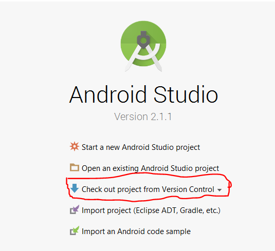

[Google Doc](https://docs.google.com/document/d/1JUePcj0W9mg6Ea__lakJK-Zd6ZFXchmqdbztLqIU4Cs/edit)
## Running Android Take it Home in Android Studio

Prerequisites:

* [Java SE Development Kit 8](http://www.oracle.com/technetwork/java/javase/downloads/jdk8-downloads-2133151.html)
* [Android Studio](https://developer.android.com/studio/index.html)

_Note:_
#### Java installation
You can check if java is already installed in your system by typing java -version in command prompt/terminal.
#### OSX
Mac users can use an older version (JDK 1.6 or above) of JDK as there are stability issues on running Android Studio in Mac when using JDK 1.8

Once you have setup Android Studio you can import the project by selecting check out project from version control as shown in the following picture:

then select github from the options. 

Then enter your user id , password and [the repository url](https://github.com/open-learning-exchange/Android-PBeLL) to import the project in Android Studio. You can also import the project by cloning the repository at first from github. Then you can Select new from the file menu of Android Studio and select import project.

