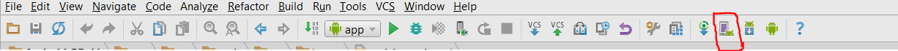
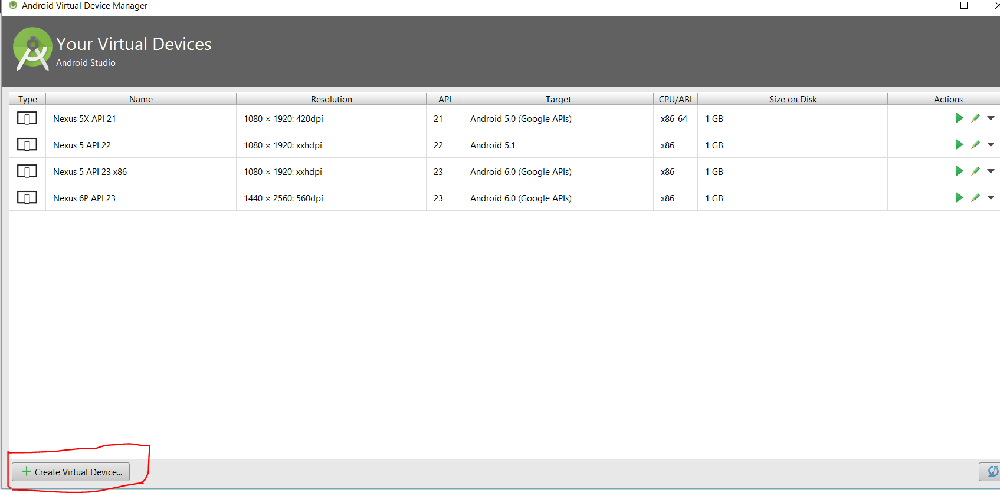

[Google Doc](https://docs.google.com/document/d/1JUePcj0W9mg6Ea__lakJK-Zd6ZFXchmqdbztLqIU4Cs/edit)
## Running Android Take it Home in Android Studio

Prerequisites:

* [Java SE Development Kit 8](http://www.oracle.com/technetwork/java/javase/downloads/jdk8-downloads-2133151.html)
* [Android Studio](https://developer.android.com/studio/index.html)

_Note:_
#### Java installation
You can check if java is already installed in your system by typing java -version in command prompt/terminal.
#### OSX
Mac users can use an older version (JDK 1.6 or above) of JDK as there are stability issues on running Android Studio in Mac when using JDK 1.8

Once you have setup Android Studio you can import the project by selecting check out project from version control as shown in the following picture:

then select github from the options. 

Then enter your user id , password and [the repository url](https://github.com/open-learning-exchange/Android-PBeLL) to import the project in Android Studio. You can also import the project by cloning the repository at first from github. Then you can Select new from the file menu of Android Studio and select import project.

#### Running the Bell App in Android Emulator

The Android Emulator has the follwing requirements:
* Android Studio 2.0 or higher 
* SDK Tools 25.0.10 or higher
* [System requirements](https://developer.android.com/studio/index.html#Requirements)
* Newly created AVDs to replace any AVDs for emulator 24.0.x or lower
* Active network connection for certain operations, such as testing app features that require it.
* adb integration enabled through Tools > Android > Enable ADB Integration.

Creating a new Android Emulator

1. Open an Android Studio Project and select AVD manager

2.From the Your Virtual Devices page of the AVD Manager, click Create Virtual Device.

The Select Hardware page appears.

3.Select a hardware profile, and then click Next.
If you don't see the hardware profile you want, you can create or import a hardware profile.
The System Image page appears.

If you see Download next to the system image, you need to click it to download the system image. You must be connected to the internet to download it.

To start the emulator and run an app in your project:
1.Open an Android Studio project and select Run Run icon.
The Select Deployment Target dialog appears.

2.The No USB devices or running emulators detected warning means that you don’t currently have any emulators running, or any detected hardware devices connected to your computer.  If you don't have any hardware devices connected or any emulators running then you can ignore the warning.

3. In the Select Deployment Target dialog, select an existing emulator definition, and then click OK. If you don’t see a definition you want to use, click Create New Emulator to launch the AVD Manager. After you define a new AVD, in the Select Deployment Target dialog, click OK.
If you want to use this emulator definition as the default for your project, select Use same selection for future launches.
The emulator launches and displays your app.

